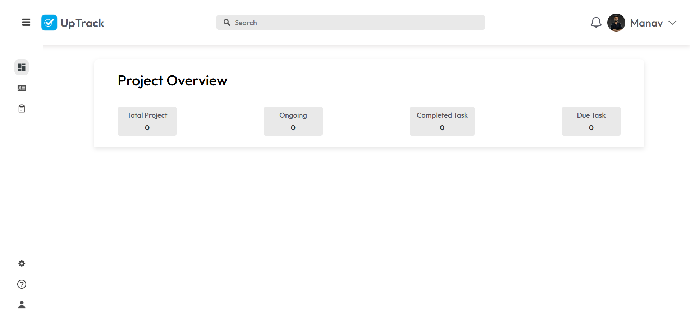
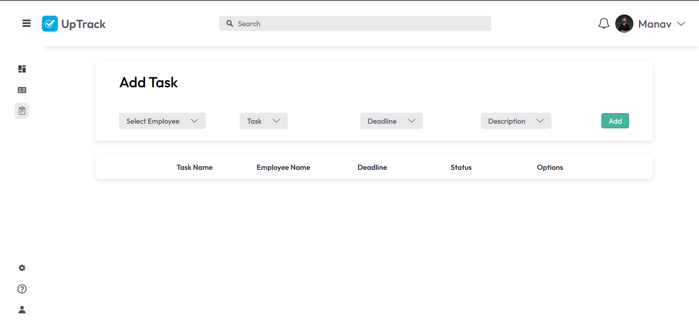
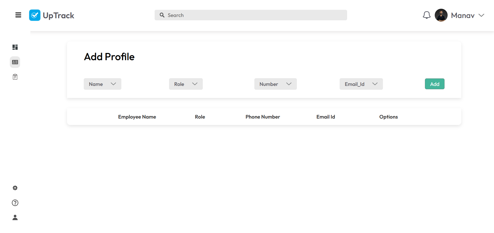

Perfect! 🚀 Tumhare **Task Management System** project ke liye ek **fancy aur professional README.md** ready karta hoon jo GitHub par bahut premium lagega. Ye README tumhare project ke features, setup steps, tech stack aur screenshots section ko showcase karega.

---

# 📌 Task Management System

🚀 A modern **Task Management System** built with **React.js** and beautifully designed in **Figma**, featuring an intuitive **Admin Panel**, **Profile Management**, and **Task Handling** functionality.

---

## ✨ Features

✅ **Admin Dashboard** – Manage tasks, profiles, and monitor system activity
✅ **Profile Management** – Add and manage employee/user profiles seamlessly
✅ **Task Management** – Create, update, delete, and track tasks with live status updates
✅ **Responsive UI** – Designed in **Figma** and implemented with **React.js**
✅ **Real-time Updates** – Task counts and status update instantly (Dashboard + Task Page)
✅ **Authentication Flow** – Secure Login/Signup with route protection
✅ **Clean UI/UX** – Sidebar, Navbar, collapsible input boxes, and live task statistics

---

## 🛠️ Tech Stack

* 🎨 **UI Design:** Figma
* ⚛️ **Frontend:** React.js (with Context API for state management)
* 💅 **Styling:** TailwindCSS + shadcn/ui components
* 🧩 **Icons & Charts:** Lucide-React, Recharts
* 🔒 **Authentication:** Local Storage-based login/signup flow
* ⚡ **Other:** Framer Motion (animations), React Router (navigation)

---

## 📸 Screenshots

### 🔹 Dashboard

### 🔹 Task Page

### 🔹 Profile Page

---

## 📌 Roadmap

* [ ] Add calendar-based task deadlines
* [ ] Implement dark mode 🌙
* [ ] Integrate backend (Node.js + MongoDB)
* [ ] Add notifications/reminders

---

🔥 *A simple yet powerful Task Management System designed with Figma & built with React.js for modern productivity!*

---

